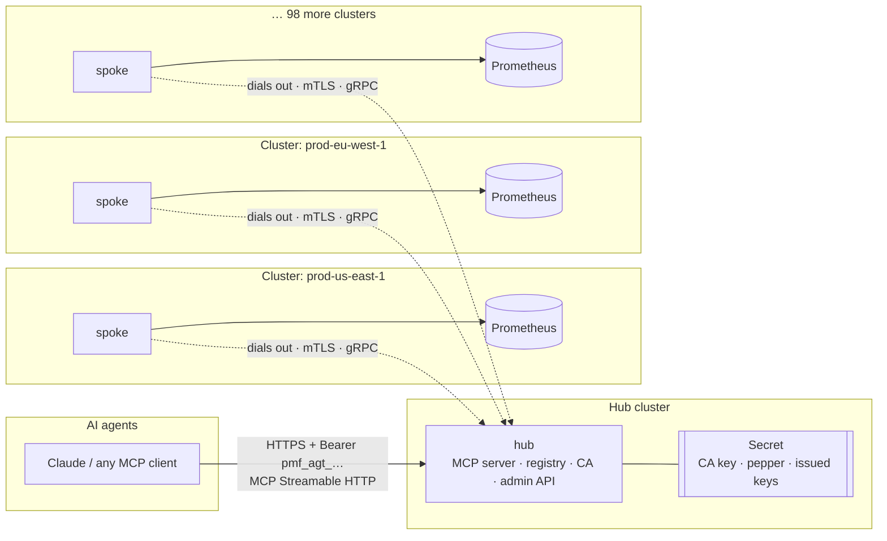
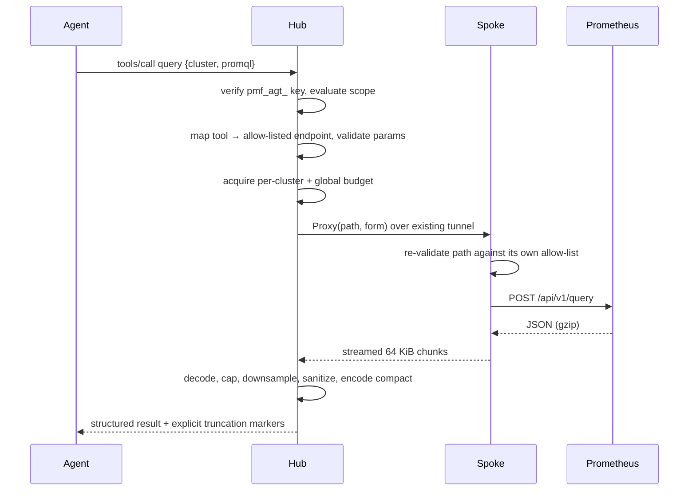

<!--
Copyright The prometheus-mcp-fleet Authors.
SPDX-License-Identifier: Apache-2.0
-->

# prometheus-mcp-fleet

**Give an AI agent one endpoint and let it query Prometheus across your entire fleet.**

[](https://github.com/jacoknapp/prometheus-mcp-fleet/actions/workflows/ci.yml)
[](https://pkg.go.dev/github.com/jacoknapp/prometheus-mcp-fleet)
[](https://goreportcard.com/report/github.com/jacoknapp/prometheus-mcp-fleet)
[](https://scorecard.dev/viewer/?uri=github.com/jacoknapp/prometheus-mcp-fleet)
[](LICENSE)

`prometheus-mcp-fleet` is a [Model Context Protocol](https://modelcontextprotocol.io)
server for fleets of Prometheus servers. You point your agent at **one hub**; a
small **spoke** runs in each cluster and dials out to that hub over a mutually
authenticated tunnel. The agent gets the full Prometheus query surface across
every cluster, with the hub handling routing, discovery, authorization and the
budget enforcement that keeps a curious model from melting a production TSDB or
its own context window.

It is built for roughly 100 clusters. The spoke idles at about 20 MiB, and
**there is no database and no PersistentVolumeClaim anywhere** — the fleet is
self-registering, so the only durable state is a little credential material in a
Kubernetes Secret.

---

## Why hub and spoke

The obvious design — point the agent at each Prometheus directly — falls over
at fleet scale for three reasons, and this project is shaped by all three.

1. **Reachability.** 100 clusters means 100 firewall exceptions, 100 ingress
   objects and 100 certificates maintained by 100 teams. The spoke dials *out*
   over ordinary egress instead, so onboarding a cluster is `helm install` plus
   one enrollment token.
2. **Discovery.** An agent asked "why is checkout latency bad in eu-west?" must
   first work out *where to look*. Each spoke publishes cluster facts — labels,
   Prometheus version, retention, job names, metric-name prefixes, alert counts
   — so the hub can answer "which clusters even have this metric?" without
   fanning a query out to all of them.
3. **Context economy.** Prometheus' native JSON will bury a model. A six-hour
   range query over 84 series is roughly 4.6 MB of JSON, which fits in no
   context window that exists. The hub re-encodes it columnar, auto-selects the
   step, caps series, and marks every truncation explicitly — the same query
   comes back at about 34 KB.

### No database

The cluster registry is *derived*, not stored. Spokes reconnect on a backoff and
re-publish their facts, so the hub rebuilds its whole view of the fleet within
seconds of a restart. The only state that genuinely must survive is credential
material — the CA key, the HMAC pepper, the issued key records and the revoked
serials — and that is small, and secret, so it lives in a Kubernetes Secret the
hub owns.

That removes a PVC, a StorageClass dependency, a backup story and a single-writer
constraint. It also means every hub replica sees the same credentials: a Secret's
`resourceVersion` gives optimistic concurrency, which is what makes single-use
enrollment atomic across replicas without a lock service.

---

## Architecture



Every arrow from a spoke points *at* the hub: spokes always initiate. Once the
mTLS handshake completes the roles invert and the spoke serves gRPC over the
connection it opened, so the hub gets HTTP/2 stream multiplexing, per-request
cancellation and deadline propagation without any bespoke framing. See
[ADR-0002](docs/adr/0002-spoke-dialed-reversed-grpc-tunnel.md).

### Request path



---

## Quickstart

### 1. Install the hub

```bash
helm install pmf-hub oci://ghcr.io/jacoknapp/charts/prometheus-mcp-hub \
  --namespace prometheus-mcp --create-namespace \
  --set ingress.enabled=true \
  --set ingress.host=pmf.example.com \
  --set tunnel.serverNames[0]=pmf-tunnel.example.com
```

The hub generates its own CA and HMAC pepper on first boot and writes them to a
Secret it owns, using a Role scoped by `resourceNames` to exactly that Secret.
Nothing sensitive goes in `values.yaml`, and there is no volume to provision.

MCP traffic is exposed through a standard `networking.k8s.io/v1` Ingress. The
tunnel port is mutually authenticated TLS and the hub must see each spoke's
client certificate, which an HTTP Ingress cannot pass through, so it gets its own
`Service` of type LoadBalancer.

### 2. Mint an agent key

```bash
kubectl exec -n prometheus-mcp deploy/pmf-hub -- \
  hub keys create --class agent --name sre-oncall-bot \
    --clusters 'env=prod' --tools query,query_range,alerts,list_clusters
# pmf_agt_3Kf9aQ2mZx…  (shown once — store it now)
```

### 3. Enroll a cluster

Mint a single-use enrollment token bound to one cluster ID:

```bash
kubectl exec -n prometheus-mcp deploy/pmf-hub -- \
  hub enroll create --cluster prod-us-east-1 --labels env=prod,region=us-east-1
# pmf_enr_9dK2mQ4pLz…  (valid 15 minutes, redeemable once)
```

Then, **in the target cluster**:

```bash
kubectl create namespace prometheus-mcp
kubectl create secret generic pmf-enrollment -n prometheus-mcp \
  --from-literal=token='pmf_enr_9dK2mQ4pLz…'

helm install pmf-spoke oci://ghcr.io/jacoknapp/charts/prometheus-mcp-spoke \
  --namespace prometheus-mcp \
  --set cluster.id=prod-us-east-1 \
  --set hub.endpoints[0]=pmf-tunnel.example.com:8443 \
  --set hub.apiUrl=https://pmf.example.com \
  --set enrollment.existingSecret=pmf-enrollment \
  --set prometheus.url=http://prometheus-operated.monitoring.svc:9090
```

The spoke generates a P-256 key, exchanges a CSR for a 14-day client
certificate, burns the enrollment token, and dials the hub. The key never
crosses the network — it is written only to a Secret in the spoke's own
namespace so a restart does not need a fresh enrollment token. Repeat for each
cluster.

### 4. Point your agent at it

```json
{
  "mcpServers": {
    "prometheus-fleet": {
      "type": "http",
      "url": "https://pmf.example.com/mcp",
      "headers": { "Authorization": "Bearer pmf_agt_3Kf9aQ2mZx…" }
    }
  }
}
```

Ask it *"which prod clusters have firing alerts right now?"* and it will call
`list_clusters`, then `alerts`, and answer.

Full walkthrough: [docs/deployment/quickstart.md](docs/deployment/quickstart.md).

---

## What the agent can do

Sixteen tools covering the Prometheus surface, all read-only:

| | |
|---|---|
| **Discover** | `list_clusters` · `describe_cluster` · `search_metrics` · `metric_metadata` |
| **Query** | `query` · `query_range` · `series` · `label_names` · `label_values` |
| **Operate** | `targets` · `rules` · `alerts` · `tsdb_stats` · `runtime_info` |
| **Fleet** | `fanout_query` — one PromQL across many clusters, partial failure reported explicitly |
| **Assist** | `explain_promql` — validate a query without executing it |

Plus MCP resources (`fleet://clusters`, `fleet://alerts/firing`) and five prompt
templates for common SRE tasks. Every tool's JSON schema, defaults, caps and
error codes: [docs/mcp-tools.md](docs/mcp-tools.md).

---

## Security model in brief

| Credential | Prefix | Lifetime | Can |
|---|---|---|---|
| Admin | `pmf_adm_` | 90d | Administer the hub, on a separate listener |
| Agent | `pmf_agt_` | 30d | Call the MCP tools its scope permits |
| Enrollment | `pmf_enr_` | 15m, **one use** | Exchange a CSR for one spoke certificate |
| Spoke identity | X.509 | 14d, auto-renewed | Serve one cluster, and only that cluster |

- **An agent never supplies a URL.** It names a tool; the tool maps to a
  hard-coded path. SSRF and path traversal are removed structurally, not filtered.
- **The spoke re-validates every request** against its own copy of the
  allow-list, so a compromised hub still cannot reach a destructive endpoint.
- **Identity is certificate-bound.** A spoke's cluster ID comes only from its
  certificate's URI SAN; nothing it reports at runtime can override it.
- **Keys are stored as HMAC-SHA256 with an out-of-database pepper**, compared in
  constant time. A database leak alone yields nothing usable.
- **The spoke's RBAC is one Secret.** It needs `get,create,update` on exactly the
  one Secret holding its own client key and certificate, restricted by
  `resourceNames` — nothing cluster-scoped, nothing else in the namespace. It
  runs with `readOnlyRootFilesystem`, non-root, all capabilities dropped, and an
  egress-only NetworkPolicy. An RBAC-free mode is available at the cost of
  re-enrolling on every restart.
- **Prompt injection is assumed to succeed.** Metric labels and alert
  annotations are attacker-influenced text; we frame them as data, strip control
  and bidirectional characters, clip lengths, and never render links. The control
  that actually holds is the scope document on the agent's key.

Full threat model: [docs/security.md](docs/security.md). Reporting:
[SECURITY.md](SECURITY.md).

---

## Operating a fleet

- **Auto-update is off by default and stays that way unless you opt in.** An
  automatic weekly rollout to 100 production clusters is a fleet-wide outage
  delivery mechanism. When enabled, the chart's CronJob resolves a digest,
  verifies its cosign signature *and* SLSA provenance, patches by digest, and
  rolls back on failure. Schedules are derived from a hash of the cluster
  identity so 100 clusters spread across a week, and `stable` only moves through
  a human-approved promotion — which is the fleet-wide kill switch.
  See [docs/operations/auto-update.md](docs/operations/auto-update.md).
- **The hub defaults to one replica.** Credentials live in a shared Secret, so
  every replica sees the same keys — but a *tunnel* pins a spoke to the replica
  that accepted it, and there is deliberately no hub-to-hub forwarding. Running
  more than one replica therefore requires each to be individually addressable,
  with spokes configured to dial all of them. Documented honestly rather than
  papered over: [docs/operations/high-availability.md](docs/operations/high-availability.md).
- Alerts, runbooks and dashboards: [docs/operations/](docs/operations/).

---

## Documentation

| | |
|---|---|
| [Architecture](docs/architecture.md) | Components, data flow, session lifecycle, failure domains |
| [Security](docs/security.md) | Threat model, PKI, credential lifecycle, prompt injection |
| [MCP tools](docs/mcp-tools.md) | Every tool, schema, example and error code |
| [Configuration](docs/configuration.md) | Every environment variable and flag |
| [Deployment](docs/deployment/) | Quickstart, hub chart, spoke chart, TLS |
| [Spoke enrollment](docs/spoke-enrollment.md) | Token → CSR → certificate → renewal → revocation |
| [Operations](docs/operations/) | Runbook, alerts, auto-update, HA, capacity |
| [Troubleshooting](docs/troubleshooting.md) | Symptom → cause → fix |
| [Development](docs/development.md) | Build, test, lint, codegen, release |
| [ADRs](docs/adr/) | Why the design is the way it is |

---

## Contributing

Contributions are welcome. Read [CONTRIBUTING.md](CONTRIBUTING.md) for the
development loop, the dependency budget (it is deliberately tiny — a new direct
dependency needs an ADR), and the review checklist.

## License

Apache License 2.0. See [LICENSE](LICENSE) and [NOTICE](NOTICE).
