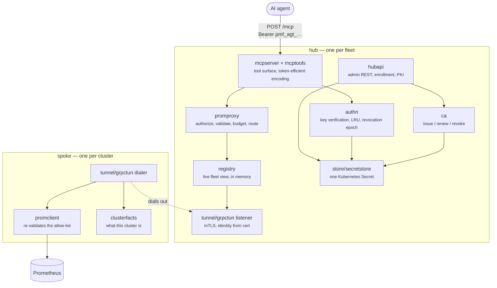
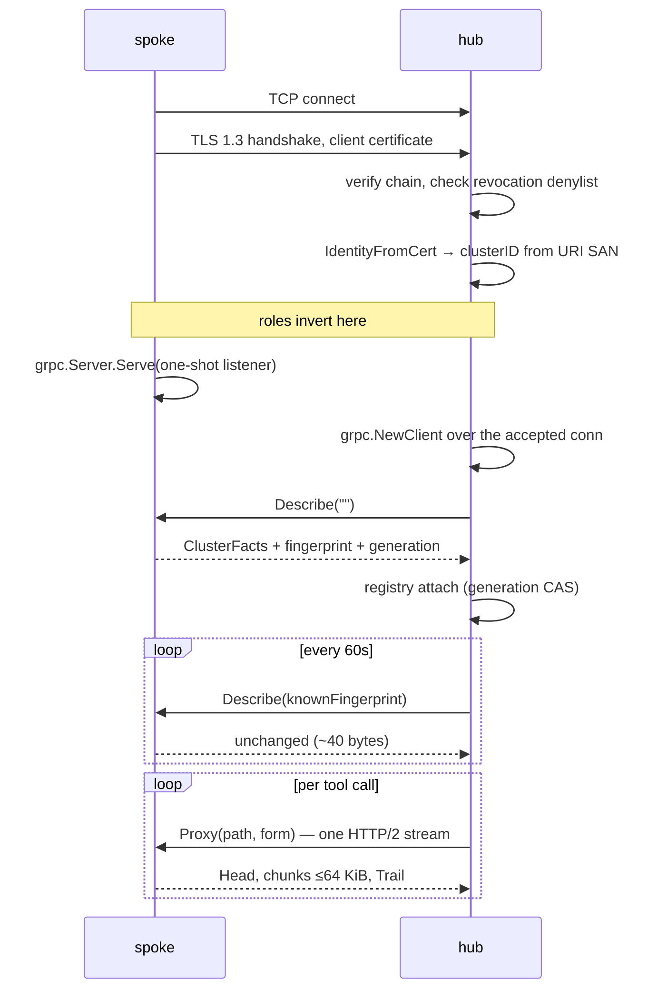
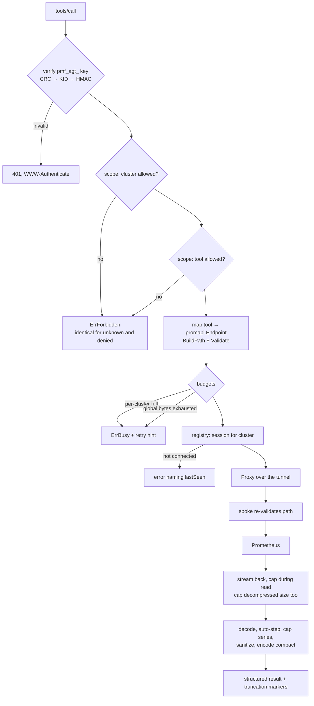
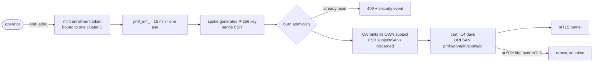

<!--
Copyright The prometheus-mcp-fleet Authors.
SPDX-License-Identifier: Apache-2.0
-->

# Architecture

This document explains how the system is put together and, more usefully, why
the surprising parts are the way they are. Decisions are recorded separately in
[docs/adr/](adr/); this is the map, those are the arguments.

## Contents

- [The problem](#the-problem)
- [Components](#components)
- [The tunnel](#the-tunnel)
- [Discovery and the registry](#discovery-and-the-registry)
- [The request path](#the-request-path)
- [State](#state)
- [Identity and trust](#identity-and-trust)
- [Failure domains](#failure-domains)
- [Package layout](#package-layout)
- [Capacity](#capacity)

## The problem

An AI agent investigating an incident needs to query Prometheus. In a single
cluster that is trivial — point it at the API. Across roughly 100 clusters,
three things break.

**Reachability.** Most clusters have no inbound path. Giving the agent direct
access means 100 firewall exceptions, 100 public names and 100 certificates,
each maintained by a different team, and it means the agent's side holds a
credential for every cluster.

**Knowing where to look.** "Why is checkout latency bad in eu-west?" cannot be
answered until something works out which cluster that is. An agent that has to
query all 100 to find out has already lost.

**Context economy.** Prometheus' JSON is not written for a context window. One
six-hour range query can exceed any model's capacity — see
[ADR-0012](adr/0012-token-efficient-tool-output.md) for the arithmetic.

Hub and spoke answers all three: one endpoint to secure, a fleet catalogue
maintained by the spokes themselves, and a single place to re-encode results.

## Components



### hub

One deployment per fleet. It runs three listeners, deliberately separated:

| Listener | Default | Exposure | Carries |
|---|---|---|---|
| MCP | `:8080` | Ingress | Agent traffic, `pmf_agt_` keys |
| Tunnel | `:8443` | LoadBalancer Service | Spoke mTLS. Needs the client certificate, so it cannot sit behind an HTTP Ingress |
| Admin | `:9090` | ClusterIP only | Admin REST (`pmf_adm_`), metrics, health, pprof |

The separation is the point. An agent key reaching the admin API would be a
privilege escalation, so the admin API is not on the port the agent can reach.

### spoke

One deployment per cluster, about 20 MiB resident. It listens for nothing but
its own metrics and health. Everything it does is a consequence of the
connection it dialed:

- serve allow-listed Prometheus requests the hub sends down the tunnel;
- re-validate each of those against its own copy of the allow-list;
- recompute cluster facts on a slow timer and answer `Describe` from cache;
- renew its client certificate at half its lifetime;
- reconnect with full-jitter backoff when the connection drops.

## The tunnel

The spoke dials the hub. Then the roles invert: the spoke runs the *gRPC server*
on the connection it opened, and the hub runs the *gRPC client* over the socket
it accepted.



Why bother with the inversion: it makes request multiplexing, per-request
cancellation, deadline propagation and flow control the protocol's job rather
than ours. The property that matters most operationally is cancellation — an
agent abandoning a range query sends `RST_STREAM`, the spoke's handler context
fires, and the upstream query is aborted *inside the remote cluster* within one
round trip. A fleet of agents will abandon queries; without this they would keep
evaluating. Full reasoning in
[ADR-0002](adr/0002-spoke-dialed-reversed-grpc-tunnel.md).

Liveness is HTTP/2 keepalive PINGs — hub side `Time: 10s, Timeout: 5s`,
`PermitWithoutStream: true`. A dead spoke is detected in about 15 seconds with
no payload and no application heartbeat code.

The response body is **opaque to the spoke**. It never parses Prometheus JSON;
it copies bytes into 64 KiB chunks. That keeps the spoke tiny, keeps it
forward-compatible with Thanos, Mimir, Cortex and VictoriaMetrics, and means all
the semantics live in one place on the hub.

## Discovery and the registry

The registry is the hub's live view of the fleet, and it is **derived, not
stored**. Each spoke publishes a facts payload on connect and whenever it
changes:

- cluster ID, display name, description, operator labels;
- Kubernetes version and node count, when the operator supplied them;
- Prometheus flavour, version, retention, scrape interval, lookback delta;
- active series and metric-name counts, when the TSDB status endpoint allows;
- sampled job names, namespaces and **metric-name prefixes**;
- rule group, alerting rule and firing alert counts; Alertmanager presence.

The metric prefixes earn their place: `kube_`, `istio_`, `jvm_` tells a model
instantly what stack a cluster runs, which is the difference between a targeted
second call and a fishing expedition.

Polling is fingerprint-based. The hub sends the fingerprint it holds; an
unchanged spoke replies `unchanged` and nothing else, so steady-state cost for
100 clusters is a few kilobytes a minute.

Session identity uses a **generation CAS**. Each session carries the spoke's
process start time in nanoseconds; a new session replaces an existing one only
if its generation is greater or equal, and the loser is drained and closed. A
stale reconnect racing a fresh one loses deterministically, so the cluster list
an agent sees never flaps or double-counts.

## The request path



Two things in that diagram are load-bearing and easy to miss.

**The agent never supplies a path.** It names a tool; the tool names an
`promapi.Endpoint`; the endpoint maps to a hard-coded template. There is no
user-controlled URL anywhere, which removes SSRF and path traversal
structurally rather than by filtering. The only user-influenced path component
in the entire system is the label name in `/api/v1/label/{label}/values`, and it
is bounded and matched against `^[a-zA-Z_][a-zA-Z0-9_]*$`.

**The spoke re-validates.** The hub's check is never the only one. A hub that is
compromised or simply buggy still cannot make a spoke call an endpoint outside
the allow-list.

## State

There is no database and no PersistentVolumeClaim
([ADR-0005](adr/0005-no-database-state-in-secrets.md)).

| What | Where | Why |
|---|---|---|
| Cluster registry | Memory | Self-registering; rebuilt from spoke reconnects in seconds |
| Live tunnel sessions | Memory | Meaningless to persist |
| Verified-key cache | Memory | 60-second TTL, invalidated by a revocation epoch |
| CA certificate and key | Kubernetes Secret | Losing it orphans every spoke |
| HMAC pepper | Separate Secret | Deliberately outside the credential store |
| Issued key records | Kubernetes Secret | KID, HMAC, scope, expiry — never a raw secret |
| Enrollment burn state | Same Secret | Needs atomicity; `resourceVersion` provides it |
| Revoked serials | Same Secret | Small, consulted at handshake |
| Spoke key and certificate | Secret in the spoke's namespace | Survives a restart without a fresh enrollment token |

Every mutation of the hub's state Secret is a read-modify-write against the
current `resourceVersion`, retried on conflict. That is what makes "burn this
enrollment token exactly once" atomic *across replicas* — a guarantee the
original single-writer database design could not have offered.

## Identity and trust



The cluster ID comes only from the certificate's URI SAN. Nothing a spoke reports
at runtime can override it — if a spoke's self-reported ID disagrees, the hub
logs a warning, counts it, and uses the certificate value.

Four credential classes, each with a different issuance path, verification path
and blast radius: `pmf_adm_` (admin listener only), `pmf_agt_` (MCP only),
`pmf_enr_` (single use, buys one certificate), and the X.509 spoke identity. An
agent key cannot enroll; an enrollment token cannot query. See
[docs/security.md](security.md).

## Failure domains

| Failure | Detected by | Effect | Recovery |
|---|---|---|---|
| Spoke pod or node dies | HTTP/2 keepalive, ~15s | That cluster reports disconnected with `lastSeen`; queries fail fast rather than hanging | Automatic on restart |
| Network partition | Same | Spoke re-dials with full jitter; generation CAS prevents a duplicate entry | Automatic |
| Prometheus down, spoke up | Spoke's own probe | Cluster reports `degraded` with a reason — the agent gets the truth, not a timeout | Automatic |
| Hub restart | — | Agents get connection errors; registry rebuilds as spokes reconnect. Monitoring itself is unaffected | Seconds |
| Hub Secret unreadable (RBAC) | Startup | Hub fails readiness with an error naming the missing rule | Fix the Role |
| CA key lost | Renewals start failing | Spokes work until their certificates expire, at most 14 days, then all must re-enroll | Restore the Secret |
| Enrollment token replayed | Atomic burn | 409 and a security event — it means the install secret leaked | Investigate |
| Agent requests an enormous range | Byte cap during read | Explicit truncation with a hint to raise `step` | Agent self-corrects |
| Agent abandons a query | `RST_STREAM` | Upstream query aborted in-cluster within one round trip | Immediate |
| One spoke floods the hub | Per-cluster semaphore | That cluster gets `ErrBusy`; the other 99 are unaffected | Automatic |
| Gzip bomb from a hostile cluster | Decompressed-size cap | Stream aborted | Automatic |

Note the asymmetry that makes a single-replica hub acceptable: when the hub is
down, an *agent* loses visibility, but Prometheus and Alertmanager in every
cluster are untouched, so a human on-call is not affected.

## Package layout

Lower layers may not import higher ones; a test in `test/arch` enforces it.

```
L0  fleet      domain types — imports nothing from this module
    version    build stamps
    config     flag + environment loader
    tunnel     transport-agnostic interfaces, no gRPC symbols
    promapi    the Prometheus allow-list, pure, no I/O
L1  obs        slog, metrics, tracing, health, pprof
    httpx      middleware and a graceful server
    token      pmf_ token format and HMAC
    kube       minimal Kubernetes Secret client
    store      credential persistence (secretstore | filestore)
    ca         internal PKI
    authn      credential verification and caching
    promclient spoke-side Prometheus client
    tunnel/grpctun · tunnel/memtun · tunnel/tunneltest
L2  registry   live fleet view
    promproxy  authorize, budget, route
    clusterfacts spoke-side facts
    hubapi     admin REST, enrollment, PKI endpoints
    mcpsurface adapter isolating the MCP SDK
L3  mcptools   the tool implementations and encoders
L4  hub · spoke composition roots
L5  cmd/hub · cmd/spoke
```

`tunnel` containing no gRPC symbols is what lets `memtun` and `grpctun` run the
same conformance suite, and what lets the hub's routing be tested with no
network at all.

## Capacity

Measured and reasoned figures for a 100-spoke fleet on one hub replica.

**Per idle tunnel on the hub:** about 86 KiB — 16 KiB each of gRPC read and
write buffer, roughly 20 KiB of TLS buffers, about 10 KiB of transport
structures, and three goroutines at 8 KiB of initial stack.

**100 idle spokes:** roughly 8.6 MiB of connections, about 2 MiB of facts, and
around 30 MiB of Go runtime baseline — call it **40 MiB idle**, 300 goroutines,
150–300 file descriptors.

**Latency, tunnel overhead only**, excluding Prometheus' own evaluation: about
one round trip plus 0.4 ms of CPU at the median. Same-region that is roughly
12 ms p50; cross-region with a 35 ms round trip, roughly 50 ms p50. Physics
dominates, so the design's job is to add no round trips — the tunnel is
pre-warmed, there is no per-request handshake, no auth round trip and no service
discovery on the hot path.

**The real risk is concurrent bulk, not idle.** A hundred agents each pulling a
32 MiB result would be 3.2 GiB if the hub buffered whole results. A global
response-byte semaphore (256 MiB by default) plus a per-cluster in-flight limit
of 8 bounds it; over budget returns `ErrBusy` with a retry hint. Bounded and
observable beats OOM-killed.

**Suggested requests and limits:** hub `250m / 256Mi` requests, `1Gi` memory
limit, **no CPU limit** — CFS throttling on a tunnel terminator is self-inflicted
latency. Spoke `25m / 64Mi` requests, `256Mi` memory limit; expect about 18 MiB
resident, since it parses nothing.
