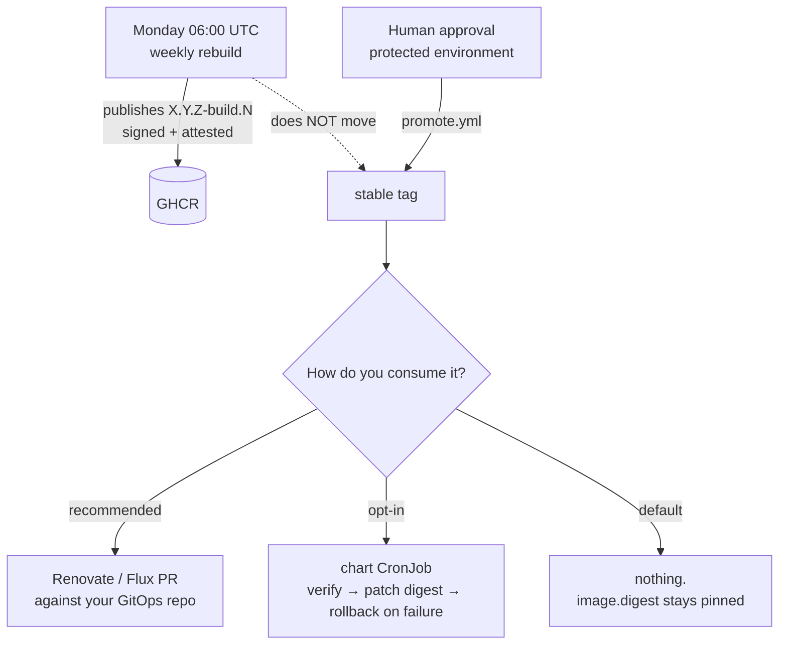

<!--
Copyright The prometheus-mcp-fleet Authors.
SPDX-License-Identifier: Apache-2.0
-->

# Weekly auto-update

**It is off by default. Read this before turning it on.**

An automatic weekly rollout to a hundred production clusters is, viewed
honestly, a fleet-wide outage delivery mechanism. A regression that survives CI
gets published on Monday morning; if the pods pull it themselves, it is running
everywhere within minutes, and the thing that would normally stop it is the
thing that is broken.

The requirement behind the requirement is still real: base images accumulate
CVEs, and a fleet pinned to a six-month-old image is its own problem. So the
design separates **publishing** from **promoting**, and makes the in-cluster
half opt-in. Full reasoning:
[ADR-0011](../adr/0011-auto-update-is-opt-in.md).

## The five layers



1. **Digest-pinned defaults.** The chart ships `image.digest`, set by the release
   workflow. Tags are for humans to read.
2. **The weekly rebuild publishes; it does not promote.** Every Monday the
   latest release tag is rebuilt from unchanged source onto fresh base images and
   published as `X.Y.Z-build.N`, re-attested and re-signed. Nothing deployed
   changes.
3. **`stable` moves only through human approval**, behind a protected GitHub
   Environment. **This is the kill switch**: stop approving and the entire fleet
   freezes, with no code change and no incident call.
4. **The recommended consumption path is not the CronJob.** It is Renovate or
   Flux against your own GitOps repository. (The intent is to publish a
   Renovate preset and/or a Flux `ImagePolicy` example for this; as of this
   writing neither ships from this repo, so point ordinary digest-tracking
   automation at `IMAGE_REPO:stable` yourself in the meantime.) This path gives
   a reviewable pull request per release. Most teams running a hundred clusters
   already have this and should use it.
5. **The chart's CronJob is the opt-in fallback**, for clusters with no GitOps.

## Enabling it

```yaml
autoUpdate:
  enabled: true
  tag: stable          # the moving tag to resolve
  cohort: canary       # canary | early | stable
  # schedule: "17 3 * * 2"   # omit to get an automatically staggered one
```

### What the CronJob actually does

1. Resolves the configured moving tag to a **digest**.
2. Runs `cosign verify` against this repository's OIDC identity **and**
   `cosign verify-attestation` for SLSA provenance.
3. **Refuses to proceed if either fails.** No override flag exists.
4. `kubectl patch`es the workload to the **digest**, never a tag.
5. `kubectl rollout status --timeout=5m`.
6. `kubectl rollout undo` on failure, and fires `PrometheusMCPAutoUpdateFailed`.

Its ServiceAccount holds `get,patch` on exactly the one Deployment this release
owns, by `resourceNames`. Nothing cluster-scoped, no ability to restart anything
else. It runs a separate minimal image, because the application images have no
shell.

### Staggering is automatic

The schedule is *derived*, not fixed:

```
identity = autoUpdate.identity, default "<release name>/<namespace>"
h        = adler32(identity)
minute   = h % 60
hour     = 2 + h % 4
shift    = 0 (canary) | 2 (early) | 4 (stable)
weekday  = (h + shift) % 7
```

The cohort shift on `weekday` is deliberate, not just the `MIN_AGE_HOURS` soak
gate above: it also nudges canary clusters earlier in the week than stable
ones, so a regression has more time to surface before the bulk of the fleet's
scheduled runs even arrive.

Every cluster that installs under the same release name and namespace hashes
to the same `identity` and therefore the same schedule — the default only
spreads a fleet across a week when each cluster's release name or namespace
actually differs. If every cluster shares both, set `autoUpdate.identity` to
something that varies per cluster (`cluster.id`, on the spoke chart) so the
hash actually differs.

A hundred clusters with distinct identities therefore spread across a whole
week without anyone coordinating anything. Set `autoUpdate.schedule` explicitly
only if you have a maintenance window you must hit.

### Cohorts

`autoUpdate.cohort` adds a promotion-age gate on top of the stagger:

| Cohort | Waits after `stable` moves | Use for |
|---|---|---|
| `canary` | 0 h | A handful of low-stakes clusters |
| `early` | 72 h | A meaningful but survivable slice |
| `stable` | 7 d | Everything else |

Put a few clusters in `canary` and the rest in `stable`. A regression that
survives CI is then caught by a handful of clusters days before the bulk moves.
A fleet where every cluster is in the same cohort has not really adopted this.

## The hub is different

**Auto-update on the hub is discouraged.** It is a single point of failure for
agent access across the whole fleet, and unlike a spoke there is no other
replica of it in another cluster to notice the problem first. If you enable it
anyway, its window is forced to run *after* the canary cohort's, never before.

## Opting out

Three ways, all equivalent in effect:

- Leave `autoUpdate.enabled: false` — the default. Nothing is rendered.
- Pin `image.digest` explicitly and set `autoUpdate.pinned: true`; the CronJob
  refuses to patch.
- Uninstall the CronJob. It holds no state.

## When it fires an alert

`PrometheusMCPAutoUpdateFailed` firing is the system **working**. See the
[runbook](runbook.md#prometheusmcpautoupdatefailed).

If several clusters report it at once, the release is bad: **stop approving
promotions**. That freezes the fleet immediately and is exactly what the
approval gate exists for.

## Verifying by hand

Everything the CronJob does, you can do yourself:

```bash
cosign verify ghcr.io/jacoknapp/prometheus-mcp-fleet/spoke:stable \
  --certificate-oidc-issuer=https://token.actions.githubusercontent.com \
  --certificate-identity-regexp='^https://github.com/jacoknapp/prometheus-mcp-fleet/'

cosign verify-attestation --type slsaprovenance \
  ghcr.io/jacoknapp/prometheus-mcp-fleet/spoke:stable \
  --certificate-oidc-issuer=https://token.actions.githubusercontent.com \
  --certificate-identity-regexp='^https://github.com/jacoknapp/prometheus-mcp-fleet/'
```

Builds are reproducible — `CGO_ENABLED=0`, `-trimpath`, and `SOURCE_DATE_EPOCH`
taken from the tag's commit time — so rebuilding the same commit yields
byte-identical binaries. That is what makes the weekly rebuild something you can
verify rather than something you have to trust.

## A note on the requirement

The literal reading of "update the pods weekly" is not the default behaviour
here, and that is a deliberate deviation rather than an oversight. We would
rather argue the case than ship the version that cannot be stopped. If your
environment genuinely wants unattended weekly updates across the fleet, layer 5
gives you exactly that — verified, digest-pinned, staggered, cohorted and
reversible.
