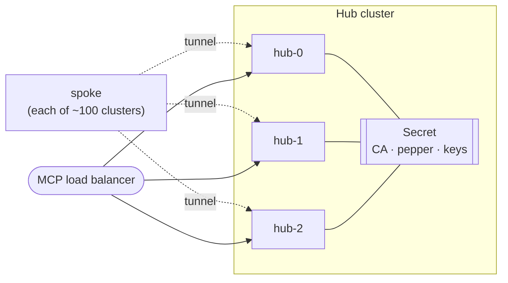

<!--
Copyright The prometheus-mcp-fleet Authors.
SPDX-License-Identifier: Apache-2.0
-->

# High availability

The short version: **the default is one hub replica, and that is a deliberate
recommendation rather than a limitation we forgot to lift.** Running more than
one requires real ingress work, and doing it half-way is worse than not doing it
at all.

## What is and is not shared

Since credential state moved out of a volume and into a Kubernetes Secret
([ADR-0005](../adr/0005-no-database-state-in-secrets.md)), hub replicas already
agree about most things.

| State | Shared across replicas? |
|---|---|
| CA, HMAC pepper, issued keys, enrollment burn state, revoked serials | **Yes** — one Secret, read-through with a short cache |
| Cluster registry | No, but it is derived: each replica rebuilds it from the spokes connected to *it* |
| Live tunnel sessions | **No.** A tunnel terminates on exactly one pod |

That last row is the whole problem. A tool call that lands on replica B for a
spoke whose tunnel terminates on replica A has nowhere to go, and there is
deliberately no hub-to-hub forwarding
([ADR-0013](../adr/0013-no-hub-peer-forwarding.md)).

**Consequence: `replicas: 3` behind a single Service does not work.** Two thirds
of tool calls would return "cluster not connected" for any given cluster. The
chart does not stop you, but the README says so and this document exists so that
nobody discovers it from an intermittent production error.

## The single-replica case

This is the right default for most fleets, and the reason is worth stating.

**When the hub is down, monitoring is not.** Prometheus and Alertmanager in
every monitored cluster carry on exactly as before. What is lost is *AI agent
access*. A human on call is unaffected; a model investigating an incident has to
wait. That asymmetry is what makes a few seconds of downtime during a rolling
update acceptable.

Recovery is fast because there is nothing to restore: no volume to reattach, no
database to replay. The hub starts, reads two Secrets, and spokes reconnect on
their own jittered backoff. Expect the fleet view to be complete within a few
seconds of readiness.

```yaml
replicas: 1          # the default
```

## Multi-replica, done properly

The supported pattern is **each spoke dials every hub replica**. Every replica
then holds a direct tunnel to every spoke: no ownership table, no forwarding
hop, no leader election, no split brain.



### What this requires

**Each replica must be individually addressable from outside the cluster.** This
is the part people underestimate. You need:

1. A distinct external hostname per replica, each routed by the Ingress to that
   replica's pod. Since the tunnel is now ordinary HTTP
   ([ADR-0014](../adr/0014-websocket-tunnel-through-standard-ingress.md)) this is
   plain Ingress routing rather than per-replica TLS endpoints — considerably
   less work than it used to be, though still work.
2. A certificate covering those names, which your existing Ingress TLS already
   handles.
3. Every spoke configured with all of them:

   ```yaml
   hub:
     endpoints:
       - wss://pmf-hub-0.example.com/tunnel
       - wss://pmf-hub-1.example.com/tunnel
       - wss://pmf-hub-2.example.com/tunnel
   ```

   The spoke opens one tunnel per endpoint and maintains each independently
   with its own backoff.
4. The MCP HTTP port behind an ordinary load balancer. **No session affinity is
   needed** — the MCP transport is stateless (protocol revision 2026-07-28
   removed sessions), and credentials come from the shared Secret.

### What it costs

Connections scale as spokes × replicas. At 100 spokes and 3 replicas that is
300 tunnels fleet-wide, roughly 10 MiB per replica — negligible. Facts polling
triples, to a few requests per second.

The design stops being right somewhere around a couple of thousand spokes or ten
replicas, at which point consistent-hash ownership with a peer proxy starts to
earn its complexity. That is a future ADR, not a present one.

### Rolling upgrades

With every spoke dialling every replica, a rolling update is transparent: the
surviving replicas still hold live tunnels throughout. This is the main
operational reason to go multi-replica, more so than availability.

## Choosing

| You want | Do this |
|---|---|
| Simplicity, and can tolerate seconds of agent downtime on upgrade | `replicas: 1`. This is most people |
| Transparent rolling upgrades and no single point of failure for agent access | Multi-replica with per-replica external addressing, as above |
| Multi-replica without the ingress work | Not supported. Pick one of the two above |

If you are unsure, take one replica. A single hub that restarts in a few seconds
is honestly better than three whose addressing was set up incorrectly.

## Verifying a multi-replica setup

Check that every spoke really is connected to every replica, rather than
accidentally to one:

```promql
# Should equal the number of enrolled clusters, on every replica
promfleet_hub_spokes_connected

# Should be the replica count, per endpoint, on every spoke
promfleet_spoke_tunnel_up
```

If a spoke shows `tunnel_up` for two of three endpoints, its third tunnel is
failing — almost always a missing SAN or a DNS record that does not resolve from
that cluster. Alert on it; a partially connected fleet fails intermittently and
is far harder to diagnose after the fact.
