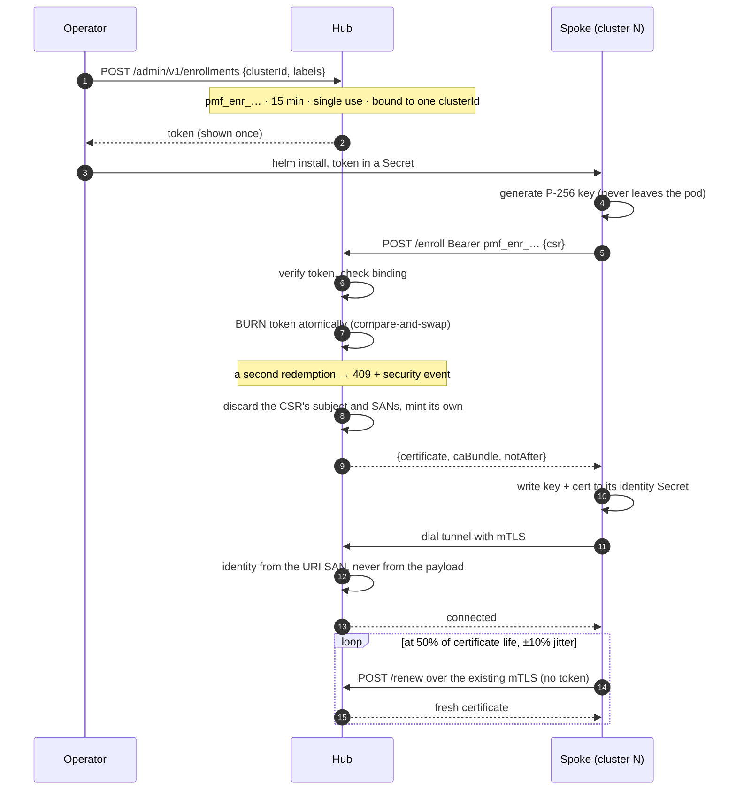

<!--
Copyright The prometheus-mcp-fleet Authors.
SPDX-License-Identifier: Apache-2.0
-->

# Spoke enrollment

How a cluster joins the fleet, keeps its identity, and leaves.

Every spoke lives in a **different cluster** and is installed as its **own Helm
release** from the `prometheus-mcp-spoke` chart. There is no shared install, no
umbrella chart, and nothing in the spoke chart references the hub's release. The
only thing a spoke knows about the hub is an address, a trust bundle and a
single-use token.

## Contents

- [The flow](#the-flow)
- [Onboarding one cluster](#onboarding-one-cluster)
- [Onboarding a hundred clusters](#onboarding-a-hundred-clusters)
- [What the certificate contains](#what-the-certificate-contains)
- [Renewal](#renewal)
- [Where the identity is stored](#where-the-identity-is-stored)
- [Removing a cluster](#removing-a-cluster)
- [When it goes wrong](#when-it-goes-wrong)

## The flow



Three properties are worth stating plainly, because they are what make this
safe:

- **The token is bound to one cluster ID.** A leaked token cannot be redeemed
  for a different cluster's identity.
- **The burn happens before the certificate is returned**, as an atomic
  compare-and-swap on the hub's state Secret. It is atomic across hub replicas
  because `resourceVersion` gives us the CAS for free.
- **The hub ignores what the CSR asks for.** A CSR requesting `CN=admin` yields
  a certificate that does not contain it. The hub mints its own subject and its
  own single URI SAN.

## Onboarding one cluster

### 1. Mint a token (on the hub)

```bash
kubectl exec -n prometheus-mcp-hub deploy/pmf-hub -- \
  hub enroll create \
    --cluster prod-us-east-1 \
    --labels env=prod,region=us-east-1,tier=customer-facing
# pmf_enr_9dK2mQ4pLz…   valid 15 minutes, redeemable once
```

The **labels matter more than they look**. Agent key scopes select clusters by
label (`matchLabels: {env: prod}`), so a cluster enrolled without them is a
cluster no scoped key can reach. Decide your label taxonomy before you onboard
the first cluster, not the fiftieth.

The cluster ID must match `^[a-z0-9]([-a-z0-9]{0,61}[a-z0-9])?$` — it ends up in
a certificate SAN — and it must be **unique across the fleet**. Two clusters
sharing an ID would fight over one identity, each disconnecting the other.

### 2. Install the spoke (in the target cluster)

```bash
kubectl create namespace prometheus-mcp
kubectl create secret generic pmf-enrollment -n prometheus-mcp \
  --from-literal=token='pmf_enr_9dK2mQ4pLz…'

helm install pmf-spoke oci://ghcr.io/jacoknapp/charts/prometheus-mcp-spoke \
  --namespace prometheus-mcp \
  --set cluster.id=prod-us-east-1 \
  --set cluster.labels.env=prod \
  --set cluster.labels.region=us-east-1 \
  --set hub.endpoints[0]=wss://pmf.example.com/tunnel \
  --set hub.apiUrl=https://pmf.example.com \
  --set hub.existingCASecret=pmf-hub-ca \
  --set enrollment.existingSecret=pmf-enrollment \
  --set prometheus.url=http://prometheus-operated.monitoring.svc:9090
```

There are no defaults for `cluster.id`, `hub.endpoints`, `hub.apiUrl` or
`prometheus.url`. Every one of them differs per cluster, and a default that
happened to work in one place would be a trap in the other ninety-nine.

### 3. Verify

```bash
kubectl -n prometheus-mcp logs deploy/pmf-spoke | grep -E 'certificate|tunnel'
# obtained client certificate  cluster_id=prod-us-east-1 not_after=…
# tunnel established           endpoint=wss://pmf.example.com/tunnel
```

From the agent side, `list_clusters` should now show it as `connected`.

## Onboarding a hundred clusters

Do not paste a hundred tokens by hand. Mint in a loop and feed your existing
delivery mechanism — the tokens are short-lived by design, so generate them as
part of the rollout rather than ahead of it.

```bash
while read -r id env region; do
  token=$(kubectl exec -n prometheus-mcp-hub deploy/pmf-hub -- \
    hub enroll create --cluster "$id" --labels "env=$env,region=$region" --quiet)
  # Hand $token to whatever installs into that cluster: a sealed secret, an
  # ExternalSecret, your CD system's secret store. It is valid for 15 minutes.
  ./install-spoke.sh "$id" "$token"
done < clusters.tsv
```

Notes for a fleet-scale rollout:

- **Stagger it.** Spokes jitter their first dial by up to five seconds and back
  off with full jitter after that, so the hub will not be stampeded — but there
  is no reason to install all hundred in the same minute either.
- **Prefer `ExternalSecret` or `SecretProviderClass`** over a literal
  `enrollment.token` value. Helm stores release values in a Secret that anyone
  with namespace read can render with `helm get values`.
- **Watch `promfleet_hub_enrollments_total{result="denied"}`.** A cluster of
  failures usually means the tokens expired between minting and install.
- Set `PMF_ENROLLMENT_TOKEN_TTL` higher on the hub if your delivery pipeline is
  slower than fifteen minutes — but treat that as a pipeline problem, not a
  configuration one.

## What the certificate contains

| Field | Value |
|---|---|
| Key | ECDSA P-256, generated in the pod, never transmitted |
| Serial | 128-bit random |
| Subject | `CN=spoke:<clusterID>` — decoration only, never used for identity |
| SAN | exactly one URI: `pmf://<trustDomain>/spoke/<clusterID>` |
| Extended key usage | `clientAuth` only |
| Basic constraints | `CA:FALSE` |
| Validity | 14 days by default, backdated five minutes for clock skew |

The hub derives the cluster ID **only** from the URI SAN, verifying the scheme,
the trust domain and the path shape. If a spoke's self-reported cluster ID
disagrees with its certificate, the hub logs a warning, counts it, and uses the
certificate value.

## Renewal

The spoke renews at **half its certificate's lifetime**, with ±10% jitter so
that a hundred spokes installed on the same afternoon do not all renew in the
same minute a week later. Renewal runs over the existing mutually authenticated
tunnel and needs **no enrollment token** — a spoke that renews on schedule never
needs an operator again.

The cluster ID for a renewal comes from the presented client certificate, never
from the request body.

When a renewal fails, the spoke logs at `warn` and retries. Inside the last 24
hours before expiry it escalates to `error`. Alert on
`promfleet_spoke_client_cert_expiry_seconds` and
`promfleet_hub_spoke_cert_expiry_seconds`.

If a certificate does expire, the spoke needs a **fresh enrollment token**. That
is intentional: an expired identity should require a deliberate act, not a
silent automatic re-issue.

## Where the identity is stored

`identity.backend` picks between three postures.

| Backend | Survives restart | RBAC needed | Use when |
|---|---|---|---|
| `secret` (default in-cluster) | Yes | `get,create,update` on **one** Secret by `resourceNames` | Normal operation |
| `file` | Yes, if the path is durable | None | Development, or running outside Kubernetes |
| `memory` | **No** | **None** | You will grant no RBAC at all |

`memory` is the honest escape hatch for a platform team that refuses any RBAC.
The cost is real and should be understood before choosing it: the spoke
re-enrolls on **every** restart, which means the enrollment token must be
multi-use and long-lived, which is a materially weaker credential than a
15-minute single-use one. Prefer the one-Secret Role.

## Removing a cluster

```bash
# In the target cluster
helm uninstall pmf-spoke -n prometheus-mcp
kubectl delete secret pmf-spoke-identity -n prometheus-mcp

# On the hub — revoke so the certificate cannot be used until it expires
kubectl exec -n prometheus-mcp-hub deploy/pmf-hub -- \
  hub certs revoke --serial <hex-serial> --reason "cluster decommissioned"
```

Uninstalling alone is not enough if the cluster or its Secret may be
compromised: the certificate stays valid for up to 14 days. Revocation is
checked during the TLS handshake, so it takes effect on the next connection
attempt.

The cluster disappears from `list_clusters` once its grace window elapses. The
registry is in memory and self-registering, so there is nothing else to clean
up — no database row, no stale entry.

## When it goes wrong

| Symptom | Cause | Fix |
|---|---|---|
| `enrollment token has already been used` (409) | The token was redeemed once already. **Treat this as a security event** — it means the install secret leaked, or an automation retried a burn | Investigate, then mint a fresh token |
| `401` from `/enroll` | The token expired. They last 15 minutes | Mint a new one; consider a faster delivery path |
| `cluster ID mismatch` | The `cluster.id` value does not match what the token was minted for | Reinstall with the right ID, or mint a token for this one |
| `x509: certificate signed by unknown authority` on the tunnel | The spoke does not trust the hub's CA | Supply `hub.caBundle` / `hub.existingCASecret`; the bundle is at `GET /pki/bundle` on the hub |
| `dial tcp: i/o timeout` to the tunnel | Egress from this cluster to the hub is blocked, or the NetworkPolicy does not permit it | This is a network problem in the spoke's cluster. Check egress rules and DNS |
| Spoke connects, cluster shows `degraded` | The tunnel is up but the spoke cannot reach its local Prometheus | Check `prometheus.url`; the reason is in `describe_cluster` |
| Spoke restarts and re-enrolls every time | `identity.backend: memory`, or the identity Secret is not persisting | Switch to the `secret` backend and grant the one-Secret Role |
| Two clusters flapping in `list_clusters` | Both were enrolled with the same `cluster.id` | Give one a new ID and re-enroll. The generation CAS means they will take turns evicting each other until you do |

For anything else, see [troubleshooting.md](troubleshooting.md).
