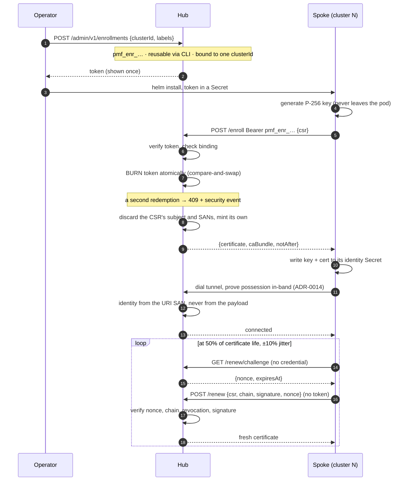

<!--
Copyright The prometheus-mcp-fleet Authors.
SPDX-License-Identifier: Apache-2.0
-->

# Spoke enrollment

How a cluster joins the fleet, keeps its identity, and leaves.

Every spoke lives in a **different cluster** and is installed as its **own Helm
release** from the `prometheus-mcp-spoke` chart. There is no shared install, no
umbrella chart, and nothing in the spoke chart references the hub's release. The
only thing a spoke knows about the hub is an address, a trust bundle and a
reusable enrollment token.

## Contents

- [The flow](#the-flow)
- [Onboarding one cluster](#onboarding-one-cluster)
- [Onboarding a hundred clusters](#onboarding-a-hundred-clusters)
- [What the certificate contains](#what-the-certificate-contains)
- [Renewal](#renewal)
- [Where the identity is stored](#where-the-identity-is-stored)
- [Removing a cluster](#removing-a-cluster)
- [When it goes wrong](#when-it-goes-wrong)

## The flow



Three properties are worth stating plainly, because they are what make this
safe:

- **The token is bound to one cluster ID.** A leaked token cannot be redeemed
  for a different cluster's identity.
- **The burn happens before the certificate is returned**, as an atomic
  compare-and-swap on the hub's state Secret. It is atomic across hub replicas
  because `resourceVersion` gives us the CAS for free.
- **The hub ignores what the CSR asks for.** A CSR requesting `CN=admin` yields
  a certificate that does not contain it. The hub mints its own subject and its
  own single URI SAN.

## Onboarding one cluster

### 1. Mint a token (on the hub)

```bash
kubectl exec -n prometheus-mcp-hub deploy/pmf-hub -- \
  hub enroll create \
    --admin-token-file /var/run/pmf/admin-token \
    --cluster prod-us-east-1 \
    --labels env=prod,region=us-east-1,tier=customer-facing
# pmf_enr_9dK2mQ4pLz…   valid 15 minutes, reusable
```

The subcommand is an HTTP client against the hub's own admin listener. The
binary itself defaults that listener to loopback only, but the shipped chart
deliberately widens it to all interfaces and publishes it on the ClusterIP
Service (`service.admin.enabled: true` by default) so kubelet probes and a
`ServiceMonitor` can reach it — access is then narrowed by a NetworkPolicy to
scrapers in the `monitoring` namespace, not by loopback binding. Running the
subcommand via `kubectl exec` still doesn't add any new network exposure of
its own. It still needs an admin credential of its own: mount one as a file
(`adminToken.existingSecret` on the hub chart does exactly this, mounting the
Secret you name at `/var/run/pmf/admin-token`; `adminToken.key` and
`adminToken.mountPath` move it) and pass `--admin-token-file`, or set
`PMF_ADMIN_TOKEN` in the pod's environment. Prefer
the file. There is no way to set an environment variable on a `kubectl exec`
without putting it in the argument list, where it lands in the node's process
table.

The **labels matter more than they look**. Agent key scopes select clusters by
label (`matchLabels: {env: prod}`), so a cluster enrolled without them is a
cluster no scoped key can reach. Decide your label taxonomy before you onboard
the first cluster, not the fiftieth.

The cluster ID must match `^[a-z0-9]([-a-z0-9]{0,61}[a-z0-9])?$` — it ends up in
a certificate SAN — and it must be **unique across the fleet**. Two clusters
sharing an ID would fight over one identity, each disconnecting the other.

### 2. Install the spoke (in the target cluster)

```bash
kubectl create namespace prometheus-mcp
kubectl create secret generic pmf-enrollment -n prometheus-mcp \
  --from-literal=token='pmf_enr_9dK2mQ4pLz…'

helm install pmf-spoke oci://ghcr.io/jacoknapp/charts/prometheus-mcp-spoke \
  --namespace prometheus-mcp \
  --set fullnameOverride=pmf-spoke \
  --set cluster.id=prod-us-east-1 \
  --set cluster.sdlc=prod \
  --set cluster.labels[0].name=env --set cluster.labels[0].value=prod \
  --set cluster.labels[1].name=region --set cluster.labels[1].value=us-east-1 \
  --set hub.endpoints[0]=wss://pmf.example.com/tunnel \
  --set hub.apiUrl=https://pmf.example.com \
  --set hub.existingCASecret=pmf-hub-ca \
  --set enrollment.existingSecret=pmf-enrollment \
  --set prometheus.url=http://prometheus-operated.monitoring.svc:9090
```

`fullnameOverride=pmf-spoke` keeps every object named `pmf-spoke` rather than
the chart's default `<release>-<chart>` (here `pmf-spoke-prometheus-mcp-spoke`)
— without it, the `deploy/pmf-spoke` used to verify and troubleshoot below
would not exist. `cluster.labels` is a **list** of `{name, value}` entries, not
a map — a duplicate key or a `sdlc` key here fails the render, since `sdlc` is
reserved for `cluster.sdlc` above. There are no defaults for `cluster.id`,
`cluster.sdlc`, `hub.endpoints`, `hub.apiUrl` or `prometheus.url`. Every one of
them differs per cluster, and a default that happened to work in one place
would be a trap in the other ninety-nine.

### 3. Verify

```bash
kubectl -n prometheus-mcp logs deploy/pmf-spoke | grep -E 'certificate|tunnel'
# obtained client certificate  cluster_id=prod-us-east-1 not_after=…
# tunnel established           endpoint=wss://pmf.example.com/tunnel
```

From the agent side, `list_clusters` should now show it as `connected`.

## Onboarding a hundred clusters

Do not paste a hundred tokens by hand. Mint in a loop and feed your existing
delivery mechanism — the tokens are short-lived by design, so generate them as
part of the rollout rather than ahead of it.

```bash
while read -r id env region; do
  token=$(kubectl exec -n prometheus-mcp-hub deploy/pmf-hub -- \
    hub enroll create --admin-token-file /var/run/pmf/admin-token \
      --cluster "$id" --labels "env=$env,region=$region" --quiet)
  # Hand $token to whatever installs into that cluster: a sealed secret, an
  # ExternalSecret, your CD system's secret store. It is valid for 15 minutes.
  ./install-spoke.sh "$id" "$token"
done < clusters.tsv
```

### Tokens are reusable by default

`hub enroll create` mints a **reusable** token unless you pass `--single-use`.
That is the default because single use does not survive contact with anything
except a human installing one cluster by hand and watching it finish:

- it cannot be committed to git, because it expires long before the commit
  merges and syncs;
- it cannot survive a cluster rebuild, because it was burned months ago;
- it cannot serve several spoke pods that start together on a fresh cluster,
  because they all enrol at once.

A reusable token gives up less than it appears to. It is still bound to exactly
one cluster, so a leak buys one cluster's identity and not the fleet's; it still
expires; it is still revocable; it can be capped with `--max-redemptions`; and
the hub still ignores what the CSR asks for and mints its own subject and SAN.

There is also a failure a reusable token quietly absorbs that a single-use one
cannot: **the lost response.** Redemption is two effects -- the hub records
the redemption, the spoke receives the certificate -- and only the first is
atomic. If the network eats the response after the store commits, a reusable
token simply retries and gets a fresh certificate; a single-use token is now
burned with nobody holding what it bought, the retry gets the 409 below, and
recovery is minting a new token. The spoke's sibling wait bounds how long that
retry hopes for a sibling (90 seconds) before surfacing the real error --
which is also the honest cost of a burn being ambiguous: the hub cannot tell
"a sibling redeemed this moments ago" from "this token was spent last week".
An expired or revoked token is *not* ambiguous and fails immediately with 401,
with no wait.

Once a cluster has enrolled, the token is largely idle: the certificate lives in
that cluster's identity Secret and is renewed with the certificate itself, not
the token. It matters again on a rebuild, when the Secret is gone.

### GitOps

The loop above is an *imperative* rollout: something mints a token and pushes it
into a cluster within fifteen minutes. A GitOps rollout has no such moment. Argo
CD or Flux reconciles the chart from git continuously, so the credential has to
be declared rather than handed over, and three things go wrong with a single-use
token:

1. **Bootstrap.** A fifteen-minute token cannot be committed. By the time the
   commit merges and the controller syncs, it has expired.
2. **Rebuild.** A cluster recreated six months later finds its token burned, and
   nothing in the pipeline mints a replacement.
3. **Long outage.** A spoke away for longer than its certificate life comes back
   to a certificate `/renew` refuses.

Mint a **reusable** token instead. It is still bound to exactly one cluster, so
a leak buys an attacker one cluster's identity and not the fleet's; it still
expires; it is still revocable; and the hub still ignores what the CSR asks for.

```bash
hub enroll create \
  --cluster prod-eu-west-1 \
  --labels env=prod,region=eu-west-1 \
  --max-redemptions 10 \
  --ttl 8760h \
  --quiet
```

Put that token in the secret store your CD system already reads — an
`ExternalSecret`, a `SecretProviderClass`, a sealed secret — and point
`enrollment.existingSecret` at it. The declared state is then stable: reconciling
the same chart with the same token is a no-op once the spoke holds a
certificate, and a re-enrollment after a rebuild just works.

`--max-redemptions` is a blast-radius control, not a correctness one. Set it to
something comfortably above how often you expect that cluster to be rebuilt; the
counter is visible on the token's admin view. Omit it for no cap.

Point 3 needs no token at all. See [Renewal](#renewal): a spoke that still holds
its private key can renew an *expired* certificate inside the hub's
`--renew-grace` window, so an outage does not consume a redemption.

Notes for a fleet-scale rollout:

- **Stagger it.** Spokes jitter their first dial by up to five seconds and back
  off with full jitter after that, so the hub will not be stampeded — but there
  is no reason to install all hundred in the same minute either.
- **Prefer `ExternalSecret` or `SecretProviderClass`** over a literal
  `enrollment.token` value. Helm stores release values in a Secret that anyone
  with namespace read can render with `helm get values`.
- **Watch `promfleet_hub_enrollments_total{result="denied"}`.** A cluster of
  failures usually means the tokens expired between minting and install.
- Set `PMF_ENROLLMENT_TOKEN_TTL` higher on the hub if your delivery pipeline is
  slower than fifteen minutes. For an imperative rollout treat that as a
  pipeline problem; for a declarative one a long TTL on a reusable token is the
  intended shape, not a workaround.

## What the certificate contains

| Field | Value |
|---|---|
| Key | ECDSA P-256, generated in the pod, never transmitted |
| Serial | 128-bit random |
| Subject | `CN=spoke:<clusterID>` — decoration only, never used for identity |
| SAN | exactly one URI: `pmf://<trustDomain>/spoke/<clusterID>` |
| Extended key usage | `clientAuth` only |
| Basic constraints | `CA:FALSE` |
| Validity | 14 days by default, backdated five minutes for clock skew |

The hub derives the cluster ID **only** from the URI SAN, verifying the scheme,
the trust domain and the path shape. If a spoke's self-reported cluster ID
disagrees with its certificate, the hub logs a warning, counts it, and uses the
certificate value.

## Renewal

The spoke renews at **half its certificate's lifetime**, with ±10% jitter so
that a hundred spokes installed on the same afternoon do not all renew in the
same minute a week later. Renewal needs **no enrollment token** — a spoke that
renews on schedule never needs an operator again.

Renewal is **not** mutual TLS, and this is worth being explicit about because it
used to be. The hub sits behind an Ingress that terminates TLS
([ADR-0014](adr/0014-websocket-tunnel-through-standard-ingress.md)), so a client
certificate presented at the TLS layer reaches the Ingress and stops there; the
hub sees no peer certificate on any request. A renewal route that read one
therefore refused every renewal in production while passing every test that
spoke TLS to it directly, and since certificates live 14 days and renew at half
life, the whole fleet would have disconnected on day 14.

Possession is proved in the request body instead, with the same construction the
tunnel handshake uses:

```
GET  /renew/challenge  ->  {"nonce": "<base64>", "expiresAt": "<RFC3339>"}
POST /renew  {csr, chain, signature, nonce}
                       ->  {certificate, caBundle, clusterId, notAfter, serial}
```

The hub verifies, in this order: that the nonce is one it issued and has not
expired; that the chain verifies against its CA; that the serial is not on the
revocation denylist; and that the signature over
`transcript(nonce, "renew-v2", clusterID, sha256(csr))` checks out under the
leaf's public key. Only then does it issue.

The CSR is inside the signature on purpose. The hub reads `/renew` as plain
HTTP behind an Ingress that terminated TLS, so the Ingress sees the request
whole; a signature that covered only the nonce would let it keep the spoke's
valid proof and swap in a CSR over a key of its own. Binding the CSR makes the
proof worthless for any CSR but the one the spoke built. Consequence for
upgrades: a spoke and a hub on different sides of the `renew-v2` change cannot
renew with each other. Existing tunnels are unaffected, and `--renew-grace`
(30d) means a spoke upgraded after its certificate lapsed still recovers, so
upgrade both within that window.

### Renewing an expired certificate

A spoke renews at half its certificate's life, so reaching expiry means the
cluster was unreachable for half a lifetime — switched off over a holiday, a
long outage, a rollout paused mid-flight. Refusing that renewal strands the
spoke permanently: renewal only ever uses the certificate, never the
enrollment token, so a reusable token sitting in the cluster's Secret does not
help — and if the original token was single-use it is long since burned. In a
declarative deployment nobody is standing by to mint a replacement.

So the hub renews an expired certificate for `--renew-grace` after expiry
(`PMF_RENEW_GRACE`, default 30 days; `0` restores strict expiry).

Nothing else is relaxed. The chain must still verify against the hub's CA, the
serial must still be absent from the denylist, and the possession proof must
still check out — the certificate is public, so on its own it proves nothing.
What the grace period concedes is only *currency*: the certificate no longer
vouches for the holder being live, and the signature has to carry that weight
alone. The chain is re-verified as of the leaf's own `notAfter` rather than with
expiry checking disabled, so an intermediate that had already gone bad when the
leaf expired is still rejected.

These renewals are logged as `cert.renewed.expired` rather than `cert.renewed`,
with `was_expired=true`, so a sweep for them is one grep. Each is worth a look:
it is either a cluster that was away a long time, or somebody replaying an
identity they should not still have.

`GET /renew/challenge` needs no credential — it is the step that lets a spoke
authenticate at all — and it stores nothing. The nonce carries its own proof
(`random ‖ expiry ‖ HMAC(pepper, …)`), so a challenge issued by one hub replica
is accepted by any other without shared state, and a hub restart does not
invalidate one in flight. It expires after 60 seconds.

The nonce is deliberately **not** single-use. Replaying a captured renewal
request returns a certificate for the public key in the captured CSR — a key
whose private half belongs to the spoke that built it — so a replay gains an
attacker nothing it can use. Enrollment is different: its token is a bearer
credential, so a `--single-use` token (or a reusable one past
`--max-redemptions`) is burned atomically and a redemption past that point is
a security event — a plain reusable token, though, is expected to be redeemed
more than once and is not.

The cluster ID for a renewal comes from the verified certificate, never from the
request body. `RenewRequest` has no cluster field at all, and the hub decodes
strictly, so a body that tries to name one is rejected outright.

When a renewal fails, the spoke logs at `warn` and retries. Inside the last 24
hours before expiry it escalates to `error`. Alert on
`promfleet_spoke_client_cert_expiry_seconds` and
`promfleet_hub_spoke_cert_expiry_seconds`.

If a certificate expires, that alone is not fatal: see
[Renewing an expired certificate](#renewing-an-expired-certificate) above — the
hub still renews it from possession proof alone, with no token, inside
`--renew-grace` (30 days by default). Only once that grace window has *also*
elapsed does the spoke need a **fresh enrollment token**. That is intentional:
an identity nobody has proved possession of in a month or more should require
a deliberate act, not a silent automatic re-issue.

## Where the identity is stored

`identity.backend` picks between three postures.

| Backend | Survives restart | RBAC needed | Use when |
|---|---|---|---|
| `secret` (default in-cluster) | Yes | `get,create,update` on **one** Secret by `resourceNames` | Normal operation |
| `file` | Yes, if the path is durable | None | Development, or running outside Kubernetes |
| `memory` | **No** | **None** | You will grant no RBAC at all |

`memory` is the honest escape hatch for a platform team that refuses any RBAC.
The cost is real and should be understood before choosing it: the spoke
re-enrolls on **every** restart, which means the enrollment token must be
multi-use and long-lived, which is a materially weaker credential than a
15-minute single-use one. Prefer the one-Secret Role.

## Removing a cluster

```bash
# In the target cluster
helm uninstall pmf-spoke -n prometheus-mcp
kubectl delete secret pmf-spoke-identity -n prometheus-mcp

# On the hub — revoke so the certificate cannot be used until it expires.
# There is no `hub certs` subcommand (only `hub enroll create` and
# `hub keys create` exist); revocation is a direct call against the admin API.
kubectl exec -n prometheus-mcp-hub deploy/pmf-hub -- \
  curl -sS -X POST "http://127.0.0.1:9090/admin/v1/certs/<hex-serial>/revoke" \
    -H "Authorization: Bearer $(cat /var/run/pmf/admin-token)" \
    -H 'Content-Type: application/json' \
    -d '{"reason":"cluster decommissioned"}'
```

Uninstalling alone is not enough if the cluster or its Secret may be
compromised: the certificate stays valid for up to 14 days. There is no TLS
handshake to check it at — as in [Renewal](#renewal), the Ingress terminates
TLS and the hub never sees a peer certificate. Revocation is instead checked
against the chain presented in the tunnel's own in-band possession proof
(ADR-0014) each time a spoke dials in, so it takes effect on the next
connection attempt.

The cluster disappears from `list_clusters` once its grace window elapses. The
registry is in memory and self-registering, so there is nothing else to clean
up — no database row, no stale entry.

### Offboarding in a GitOps fleet

State the risk plainly: **in a GitOps fleet, "remove a cluster" usually means
deleting a folder in git.** Argo CD or Flux prunes the resulting orphaned
resources, which runs the equivalent of `helm uninstall` and drops the
identity Secret. That is step one of three above. Nothing deletes the folder
*and* revokes the certificate *and* nobody is alerted that revocation didn't
happen — so the default GitOps offboarding path silently leaves a valid
credential outstanding for up to 14 days, and there is no
`PrometheusMCPClusterOffboardedUnrevoked`-style alert anywhere in this repo to
catch it. If that cluster (or its old identity Secret, e.g. from a backup) is
compromised in that window, nothing stops it dialing back in.

Two things fix this, and they cover different failure modes — use both:

**1. Make revocation part of the deletion, not a step after it.** Attach the
revoke call to the same Argo CD delete as a `PreDelete` resource hook in that
cluster's own Application, so a folder deletion *is* the complete decommission
— one action, not three:

```yaml
apiVersion: batch/v1
kind: Job
metadata:
  name: pmf-spoke-revoke
  annotations:
    argocd.argoproj.io/hook: PreDelete
    argocd.argoproj.io/hook-delete-policy: HookSucceeded
spec:
  template:
    spec:
      restartPolicy: Never
      serviceAccountName: pmf-spoke-revoke   # read-only on the identity Secret; nothing else
      containers:
        - name: revoke
          image: alpine/openssl:3.4
          command: ["/bin/sh", "-c"]
          args:
            - |
              set -e
              apk add --no-cache curl >/dev/null
              serial=$(kubectl get secret pmf-spoke-identity -n prometheus-mcp \
                -o jsonpath='{.data.tls\.crt}' | base64 -d | \
                openssl x509 -noout -serial | cut -d= -f2 | tr 'A-F' 'a-f')
              curl -sS -f -X POST \
                "https://pmf.example.com/admin/v1/certs/${serial}/revoke" \
                -H "Authorization: Bearer $(cat /var/run/pmf/admin-token)" \
                -H 'Content-Type: application/json' \
                -d '{"reason":"gitops folder deleted"}'
```

This runs *in the cluster being deleted*, before Argo CD prunes it, while the
identity Secret still exists to read the serial from. It needs its own admin
credential mounted into that cluster and network egress to the hub's admin
listener — both a real cost, since it means every spoke cluster now holds a
credential capable of calling the admin API, not just an enrollment token
scoped to itself. Give that ServiceAccount/ExternalSecret only what this Job
needs, expect it to be revocation-only in practice, and treat it with the same
care as the enrollment token it sits next to.

**2. Assume the hook sometimes doesn't run, and catch that centrally.** A
force-deleted Application, a cluster that's gone before the hook can dial out,
or someone bypassing the PreDelete path entirely (a manual `helm uninstall`) —
all skip step 1 above the same way the original three-step process did. Run a
periodic reconciliation on the **hub side**, where the admin credential
already safely lives, comparing what git declares against what the hub still
trusts:

```bash
# Clusters git says should exist
git -C fleet-inventory ls-tree -d --name-only HEAD clusters/ | sort -u > declared.txt

# GET /admin/v1/enrollments returns every enrollment-class key, i.e. {"keys":
# [{"enrollment": {"clusterId": ..., "certSerial": ...}}, ...]} — not a flat
# "enrollments" array. Pair each cluster with the serial of the certificate it
# last had issued, so it can be checked against the revocation list below.
curl -s -H "Authorization: Bearer $ADMIN_TOKEN" \
  localhost:9090/admin/v1/enrollments | \
  jq -r '.keys[] | select(.enrollment.certSerial) | "\(.enrollment.clusterId) \(.enrollment.certSerial)"' \
  > enrolled.tsv
curl -s -H "Authorization: Bearer $ADMIN_TOKEN" \
  localhost:9090/admin/v1/certs/revoked | jq -r '.revoked[].serial' \
  > revoked_serials.txt

# Cluster ID, for every cluster the hub knows about that git no longer
# declares AND whose certificate is not already revoked — i.e. offboarding
# stopped after `helm uninstall` and never reached revocation.
while read -r cluster serial; do
  grep -qxF "$cluster" declared.txt && continue        # still declared: fine
  grep -qxF "$serial" revoked_serials.txt && continue  # already revoked: fine
  echo "$cluster"                                      # neither: page on it
done < enrolled.tsv
```

Anything that prints is a cluster git no longer knows about *and* whose
certificate is still valid — offboarding stopped after `helm uninstall`. Page
on it rather than auto-revoking — a stale inventory checkout or a rename can
produce a false positive, and revocation is exactly the kind of action you
don't want a cron job getting wrong unattended. There is no shipped alert for
this reconciliation -- it has to be a script you own, run on a schedule -- but
the pieces it needs are commands now: `hub certs list` for what the hub still
trusts, and `hub certs revoke --serial` for what your inventory says should
be gone.

| Symptom | Cause | Fix |
|---|---|---|
| `this enrollment token has already been redeemed and cannot be redeemed again` (409) | The token was redeemed once already (only possible for a `--single-use` token, or a reusable one past `--max-redemptions`). **Treat this as a security event** — it means the install secret leaked, or an automation retried a burn | Investigate, then mint a fresh token |
| `401` from `/enroll` | The token expired. They last 15 minutes | Mint a new one; consider a faster delivery path |
| `cluster ID mismatch` | The `cluster.id` value does not match what the token was minted for | Reinstall with the right ID, or mint a token for this one |
| `x509: certificate signed by unknown authority` on the tunnel | The spoke does not trust the hub's CA | Supply `hub.caBundle` / `hub.existingCASecret`; the bundle is at `GET /pki/bundle` on the hub |
| `dial tcp: i/o timeout` to the tunnel | Egress from this cluster to the hub is blocked, or the NetworkPolicy does not permit it | This is a network problem in the spoke's cluster. Check egress rules and DNS |
| Spoke connects, cluster shows `degraded` | The tunnel is up but the spoke cannot reach its local Prometheus | Check `prometheus.url`; the reason is in `describe_cluster` |
| Spoke restarts and re-enrolls every time | `identity.backend: memory`, or the identity Secret is not persisting | Switch to the `secret` backend and grant the one-Secret Role |
| Two clusters flapping in `list_clusters` | Both were enrolled with the same `cluster.id` | Give one a new ID and re-enroll. The generation CAS means they will take turns evicting each other until you do |

For anything else, see [troubleshooting.md](troubleshooting.md).
